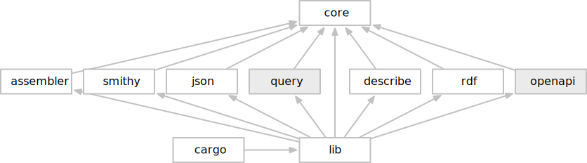

# Crate structure

The following figure shows the current set of crates and their dependencies. For most tools it is easiest to simply rely on the `lib` crate in the same way the `cargo` crate does in the figure below.

1.8: Crates

* **core**; contains the core model and framework elements such as the `ModelReader`, `ModelWriter` traits, and `Action`, `Linter`, and `Validator` traits.
* **assembler**; provides the ability to load multiple files, in supported representations, and merge into a single model.
* **smithy**; contains implementations of the `ModelReader` and `ModelWriter` traits for the Smithy IDL representation.
* **json**; contains implementations of the `ModelReader` and `ModelWriter` traits for the JSON AST representation.
* **query**;
* **describe**; contains an implementation of the `ModelWriter` traits that generates formatted documentation.
* **rdf**; contains an implementation of the `ModelWriter` traits for an RDF representation.
* **openapi**; 
* **lib**;
* **cargo**; 
