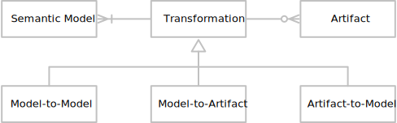
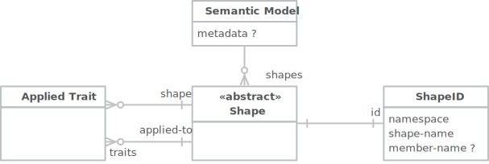
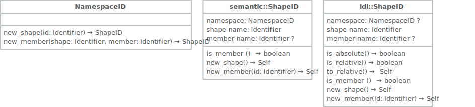
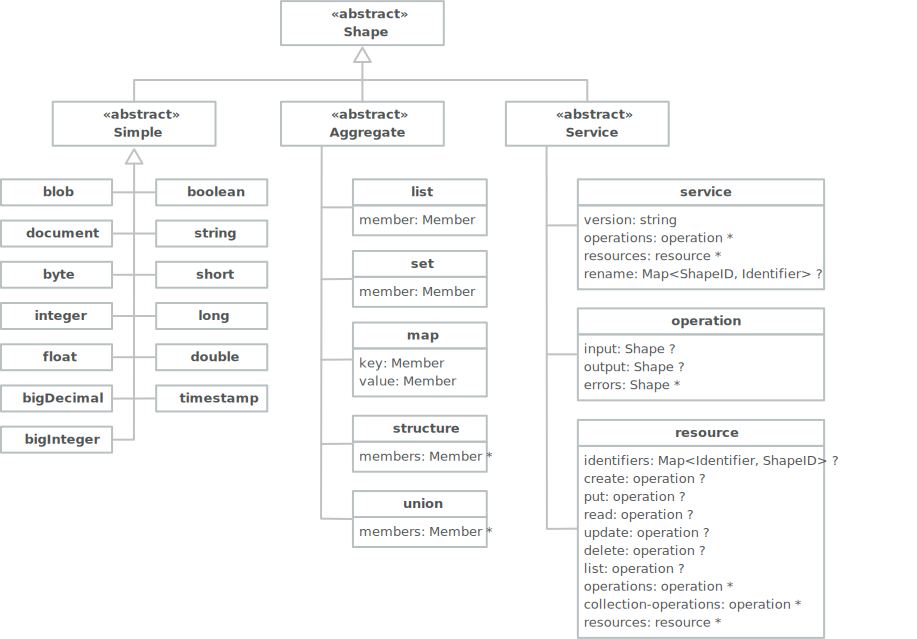

# Smithy Overview

[Smithy](https://awslabs.github.io/smithy/) is effectively a framework consisting of a semantic model, a custom IDL language, a mapping to/from JSON, and a 
build process. The semantic model is therefore consistent across different representations allowing different 
representations to be used for human readability as well as machine/tool usage. 

> _Smithy_ is an interface definition language and set of tools that allows developers to build clients and servers in multiple languages. Smithy models define a service as a collection of resources, operations, and shapes. A Smithy model enables API providers to generate clients and servers in various programming languages, API documentation, test automation, and example code.

Figures in this section use a combined ER notation to denote cardinality alongside UML inheritance relationships as needed.

## Framework

The following figure demonstrates the framework elements and their relations.

1.1: Smithy Conceptual Model

* **Semantic Model**; is the in-memory model used by tool. The semantic model has no file or format details associated with it, it may be serialized using a representation into a model file.
* **Representation**; is a particular model file format such as the Smithy IDL or JSON AST.
* **Mapping**; is a set of rules that allow for reading and writing a representation. Some representations may not provide a meaningful mapping for read or write.
* **Artifact**; typically a file on the file system, in a particular representation. A single model is serialized into one, or more, artifacts potentially with different representations.

The build process takes multiple model files, validates them, and combines them into a single instance of the semantic model. The process may also perform model transformations to add or remove shapes and metadata before any final artifact generation. 

Artifacts may represent different parts of the IDL for a given application but also their dependencies thus enabling the sharing of common shapes. Most tools will only ever deal with the semantic model interfaces with serialization and deserialization simply handled by representation mappings.

### Transformations

The build process mentioned above takes advantage of a number of transformations and while the term process is useful in the build sense the following transformation terms are more specific.

* _model-to-model_; the act of creating one output model from one or more input model, such as a projection to select only certain shapes from the input model(s).
* _model-to-artifact_; the act of creating model files, _or_ generating code or infrastructure artifacts.
* _artifact-to-model_; the act of creating a model from one or more model files or other artifacts such as an OpenAPI file.

The following figure shows that a transform has to have one or more models and may have zero or more artifacts.

1.2: Transformations

## The Semantic Model

The semantic model is a specified in-memory model used by tools. It consists of a set of shapes that corresponds to the data and behavioral elements of a service. 

1.3: The Semantic Model

* **Semantic Model**; a container of shapes and optional [metadata](#values).
* **Shape**; a defined thing, shapes are either _simple_, _aggregate_ or _service_ types as described [below](#shapes).
* **Applied Trait**; [traits](#traits) are a meta feature that allows for values to be associated with shapes. Tools may use applied traits for additional validation and code generation.
* **ShapeID**; the identifier for all shapes defined in a model, all members of defined shapes, and the names of all traits.

### Shape IDs

The shape identifier is a key element of the semantic model and representations. From the Smithy spec:

> _A shape identifier is used to identify and connect shapes. Every shape in the model is assigned a shape ID which can be referenced by other parts of the model like member targets, resource bindings, operation bindings, and traits. All shape identifiers in the semantic model must be absolute identifiers (that is, they include a shape name and namespace)_.

1.4: Shape IDs

Shape ID has three query methods, `is_absolute` is true if the id has a namespace; `is_relative` is true if the id _does not_ have a namespace; and `is_member` returns true if the id has a member name. It also has four conversion methods, `to_absolute` returns a new id with the shape name and any member name intact but with the provided namespace; `to_relative` returns a new id with the shape name and any member name intact but any previous namespace is removed; `to_member` returns a new id with the namespace and any shape name intact but with the provided member name; and `to_shape` returns a new id with the namespace and any shape name intact but any previous member name is removed.

## Shapes

Shapes come in three kinds; _simple_, _aggregate_, and _service_. A simple shape is the type for an atomic or primitive value such as `integer` or `string`. Aggregate shapes have members such as a `list` of `string`s or an address `structure`. Service shapes have specific semantics, unlike the very generic simple and aggregate shapes, as they represent either a _service_, a _resource_ managed by a service, or _operations_ on services and resources.

1.5: Shapes

Note that the inheritance relationships in this model are not necessary to implement the semantic model semantics but do make it more understandable.

### Members

The aggregate types _list_, _set_, _map_, _structure_, and _union_ all reference a Member type. This type is shown below, but basically it allows for an identifier as well as a set of traits to be applied to the aggregate type's components.

1.6: Members

### Traits

Traits in the Smithy IDL look very much like Java annotations, and fulfill a similar role; _In the Java computer programming language, an annotation is a form of syntactic metadata that can be added to Java source code._ — _Wikipedia_. However, in Java and other programming languages that support annotations these _must_ be added to the declaration of the source element. In contrast, Smithy allows traits to be _applied_ to a shape in a different artifact or different model entirely.

The term _applied trait_ refers to the usage of a trait either directly or indirectly applied to a shape or member. A _trait declaration_ is simply a simple or aggregate shape declaration with the meta-trait `trait` applied to it.

## Values

There are a few places in the semantic model where data values are used, and the following demonstrates the values supported by the model. 

1.7: Data Values

* **metadata**; every Model has an optional metadata `Object` which is often used to store tool or process specific values.
* **node-value**; a trait application has values for the structure that defines the trait itself.
* **members**; the aggregate values, `Array` and `Object`, contain `Value` members.

Note that there is no value type for `ShapeID`, these are stored in the semantic model as simply strings, their validation happens before the creation of the model and are treated only as opaque values by the model itself.