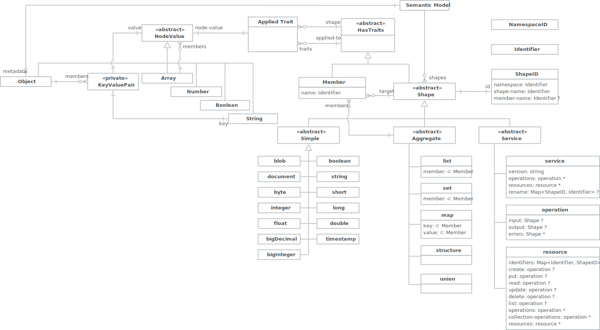

# Java & Rust Implementation Differences

The following, for reference, is a combined view of the semantic model from the [Smithy Overview](../introduction/smithy.md).
Clearly this view is language-neutral and is unlikely to produce an idiomatic interface if implemented as-is.

A.1: The Combined Semantic Model

## The Java Model

The Java model includes a number of additional abstract classes to take advantage of implementation inheritance provided 
by the Java object model. 

A.2: Java Implementation

Points of interest:

1. `MemberShape` and all the model shapes share a common `Shape` base class.
1. The `ShapeType` and `NodeType` enumerations allow for type determination between shapes and nodes at runtime.
1. The use of Java's `Number` class allows for a wide range of concrete numeric types.

## The Rust model

The corresponding Rust model on the other hand makes little use of inheritance, except for a few traits, but makes use 
of enumerations instead.

A.3: Rust Implementation

Points of interest:

1. `Node` has been renamed as `Value`, a more approachable and less generic term.
1. `TopLevelShape` has been introduced as the container type for all non-member shape types.
1. Neither `TopLevelShape`, or `MemberShape`, share a common parent type but do implement the common traits 
   `HasIdentity`, `HasTraits`, and `NonTraitEq`.
1. The use of Rust enumerations for `ShapeKind`, `Simple`, and `Value` allow for run-time type determination without 
   explicit "Type" values.
1. The `Service::rename` and `Resource::identifiers` values map between `ShapeID` and `Identifier` rather than the 
   `ShapeID` and `String` used in Java.
1. Nullable values translate to Rust `Option` type.
1. Java `List` containers translate to Rust `Vec` containers.
1. Java `Set` containers translate to Rust `HashSet` containers.
1. Java `Map` containers translate to Rust `HashMap` containers.

### Traits

The Java implementation uses Java service discovery to describe traits as Java classes and apply them to models. There 
isn't a direct comparison in Rust to the Java service framework and so traits have to be dealt with in a more static 
manner (details TBD). 

### Model Operations

The Java implementation incorporates a number of operations, such as builders, serialization and validation, into the 
core model which is common for Java. Rust on the other hand tends toward smaller units of packaging and therefore more 
decoupling of these operations from the model itself. 

The [core crate](https://crates.io/crates/atelier_core) provides the following modules which are further extended in 
separate crates.

* **action**; the `Action`, `Linter`, `Validator`, and `Transformer` traits used to perform the corresponding operations 
  on models. The module also provides some basic lint, transform, and validate implementations.
* **builder**; a set of builder types providing a more fluent style for model construction.
* **io**; the `ModelReader` and `ModelWriter` traits for implementing serialization of different representations.
* **model**; just the types necessary to hold the in-memory semantic model.

Additionally, the following crates externalize operations.

* **[assembler](https://crates.io/crates/atelier_assembler)** provides model discovery and merge.
* **[json](https://crates.io/crates/atelier_json)** provides support for the JSON AST representation.
* **[smithy](https://crates.io/crates/atelier_smithy)** provides support for the Smithy IDL representation.